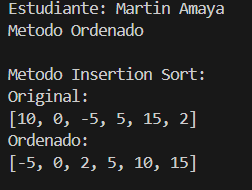
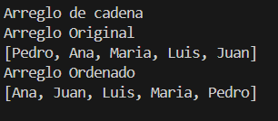
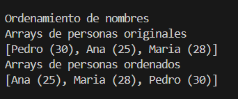
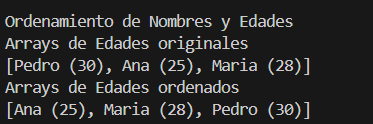

# Estructura de datos

**Estudiante:** Martin Amaya

## Metodos Ordenamiento

### Practica 1 - 20/OCT
Metodo Sort Bubble

### Practica 2 - 21/OCT
Metodo Sort Selection en Java y Python

# Salida de java

# Salida de Python

### Practica 3 - 23/OCT
Metodo Sort Insertion en Java

# Salida en Java
## Arreglo Numeros enteros

## Arreglo de Cadena

## Arreglo ordenado por nombres

## Arreglo ordenado por edades

