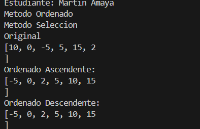
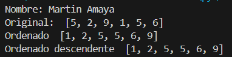

# Estructura de datos

**Estudiante:** Martin Amaya

## Metodos Ordenamiento

### Practica 1 - 20/OCT
Metodo Sort Bubble

### Practica 2 - 21/OCT
Metodo Sort Selection en Java y Python

# Salida de java

# Slaida de Python

